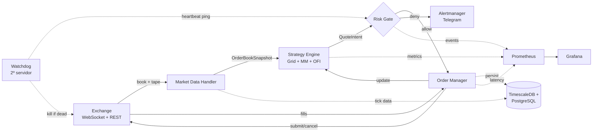
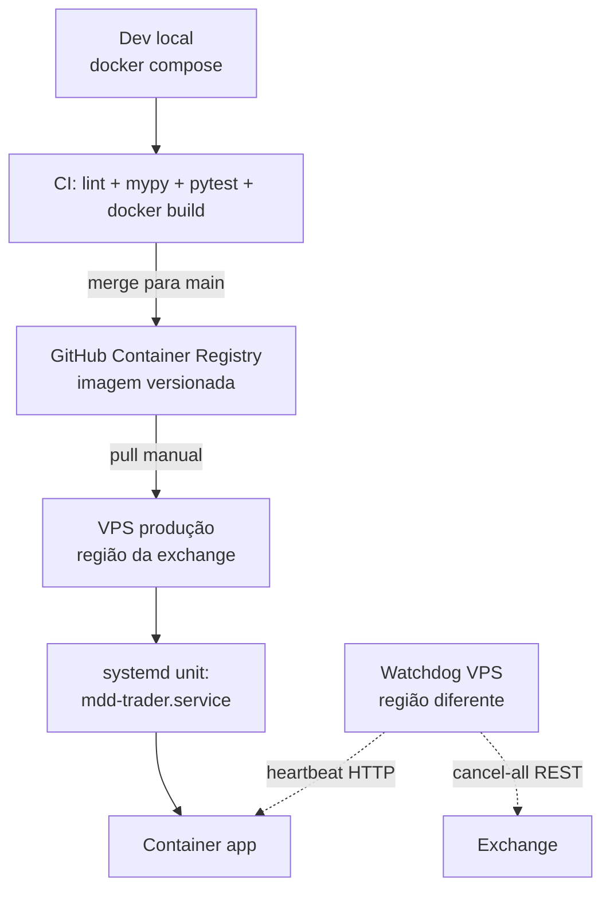

# Arquitetura — Máquina de Dinheiro

> Visão técnica do sistema. Acompanha o documento de tese
> ([TRADING_THESIS.md](TRADING_THESIS.md)).

---

## Diagrama de Alto Nível

---

## Componentes

### Market Data Handler (`src/data/`)

- Cliente WebSocket único por exchange.
- Mantém book L2 local sincronizado (snapshot + diffs).
- Publica eventos em `asyncio.Queue` para o Strategy Engine.
- Detecção de gaps de sequência → ressincronização automática.
- Latência alvo: ≤ 50ms desde timestamp do exchange.

### Strategy Engine (`src/strategy/`)

- Recebe book, calcula quotes-alvo segundo modelo (ver [TRADING_THESIS.md §3](TRADING_THESIS.md#3-modelo-matemático-alto-nível)).
- **Throttle**: só emite QuoteIntent se desvio do quote vivo > threshold (evita spam).
- Mantém inventário interno; sincroniza com OMS via fills.
- Stateless por design → fácil de testar.

### Risk Engine (`src/risk/`)

- **PROCESSO ISOLADO** (multiprocessing, não compartilha event loop).
- Toda QuoteIntent passa por `RiskGate.check_pre_trade()` antes do OMS.
- Gatilhos:
  - `max_daily_drawdown` → flatten + halt 24h
  - `max_position_per_side` → recusa novas ordens nessa direção
  - `latency_p99 > limite por 30s` → pausa novas, mantém existentes
  - `inventory_skew > limite` → força quote agressiva no lado oposto
  - `heartbeat_lost` (watchdog externo) → cancel-all via REST de emergência

### Order Manager (`src/oms/`)

- Idempotência via `client_order_id`.
- Reconciliação a cada 60s entre estado local e API REST.
- Cancelamento em massa em < 100ms (usa endpoint nativo da exchange).
- Histórico completo no PostgreSQL.

### Persistência (`infra/timescaledb/`)

- **TimescaleDB hypertables** para `book_snapshots`, `trades_tape`, `equity_snapshots`.
- **PostgreSQL puro** para `orders`, `fills`, `risk_events`.
- Schema versionado via Alembic.
- Retenção: 90d de tick data raw; agregações mantidas indefinidamente.

### Observabilidade (`src/metrics/` + `infra/`)

- Prometheus scraping em `:9100/metrics`.
- Métricas-chave: WS latency, order submit latency, fills, inventory, equity, PnL, risk events.
- Grafana dashboards provisionados via YAML.
- Alertmanager → Telegram bot para eventos CRITICAL.

---

## Stack e Decisões

| Componente | Tecnologia | Justificativa |
| --- | --- | --- |
| Linguagem | Python 3.11+ | Ecossistema quant maduro; grid não exige sub-ms |
| Async runtime | `asyncio` + `uvloop` (Linux/Mac) | uvloop é ~2x mais rápido que default |
| Serialização hot path | `msgspec.Struct` | ~10x mais rápido que dataclass, validação opcional |
| Numérico | `numpy` + `polars` + `numba` em hot loops | Polars > pandas para tick data |
| WebSocket | `websockets` (puro asyncio) | Controle fino; sem overhead de wrappers |
| HTTP REST | `httpx` | HTTP/2, connection pooling, async |
| Banco | `asyncpg` + `sqlalchemy[asyncio]` | asyncpg é o driver Postgres mais rápido |
| Config | `pydantic-settings` v2 | Validação + secrets + env files |
| Logging | `structlog` | JSON em prod, console-friendly em dev |
| Container | Docker multi-stage + `tini` | Builder/runtime split; reaping de zumbis |
| Process supervisor (prod) | `systemd` ou Docker Swarm | K8s é overkill para 1-3 containers |

---

## Garantias e Trade-offs

### Garantimos

- **Idempotência** de submissão de ordens (via `client_order_id`).
- **Reconciliação** periódica entre estado local e exchange.
- **Isolamento** do Risk Engine (não pode ser bloqueado por bug no Strategy).
- **Persistência durável** de toda ordem e fill antes de ACK ao Strategy.

### NÃO garantimos (limitações aceitas)

- Sub-millisecond latency — não competimos com HFT em fila de book.
- Zero perda de eventos em falha de WS — reconexão pode causar gap; estado é
  reconstruído via REST snapshot.
- Operação durante manutenção planejada da exchange.

---

## Fluxo de Deploy

Deploy é **manual e auditado**, NÃO automatizado para main. Cada deploy:

1. Pull da imagem versionada.
2. `docker compose pull && docker compose up -d`.
3. Verificação manual de métricas Grafana por 15 min antes de habilitar trading real.

---

## Próximos Passos

Fase 0 → entregar este ambiente reproduzível. Fase 1 começa com benchmark
quantitativo de exchanges (ver [TRADING_THESIS.md](TRADING_THESIS.md)).
